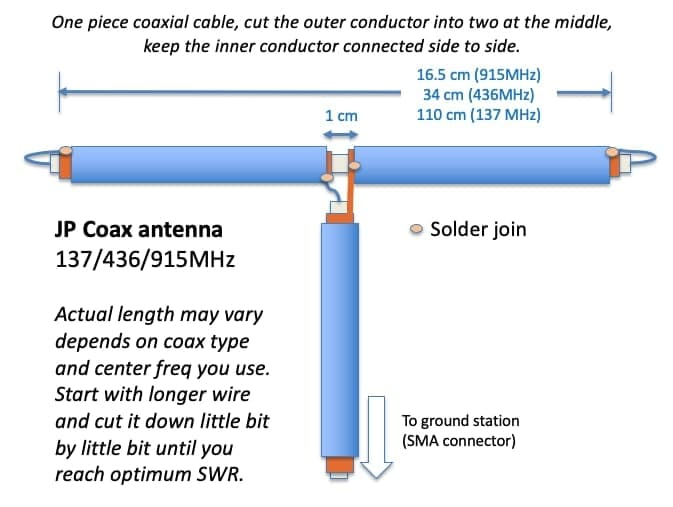

# Workshop guide for installation and monitoring of a TinyGS for SPACK
This repository contains the code, information and the necessarydocumentation to make a satellite signal mini-receiver with LoRa modulation.


This kind of receiver is based on standards of the project [TinyGS](https://github.com/G4lile0/tinyGS) created by:
- [4m1g0](https://github.com/4m1g0)
- [G4lile0](https://github.com/G4lile0)
- [gmag11](https://github.com/gmag11)

TinyGS is defined as an open network of ground stations distributed around the world to receive and operate LoRa satellites, meteorological balloon and other flying objects, using inexpensive and versatile modules. Unlike others, it does not require extensive knowledge in telecommunications or amateur radio licenses. It is oriented on the one hand to the participation of people in the Maker world without great technical profile. And on the other, to provide service to satellite operators receiving telemetry and other data in real time thanks to the worldwide deployment of the network of these stations.

The TinyGS network is growing exponentially and is destined to play an important role in the strategy of public and private mini-satellite projects.

</br>
</br>


## Construction of the receiving station
### Hardware configuration
In choosing the microcontroller there are many options. For the workshop we have chosen the **TTGO LoRa32 V2 (433MHz)**
In addition to this board you will need the following:
- [ ] A Telegram user
- [ ] WiFi network 

The installation procedure is constantly evolving. For this reason we list the main blocks without going into details. For more information, consult the links.
1. [Intall the _firmware_ in the microcontrolator](https://github.com/G4lile0/tinyGS/wiki/Quick-Start).
2. Get the platform credentials (MQTT). For this you will have to access the Telegram BOT: @tinygs_personal_bot:


3. [Set up the station](https://github.com/G4lile0/tinyGS/wiki/Ground-Station-configuration).

### Assembly
Como soporte a la placa del microcontrolador tenemos dos opciones::
* For indoor use: [3D case](https://github.com/McOrts/taller-lora-sat-groundstation/blob/main/3D/TTGO_LoRa32.chitubox):


* For outdoor you can use Sonoff relays case:


The ** antenna ** is the key piece that you will have to pay attention to frequently. Because it will require regular reorientations and changes based on the satellite that you have as reception priority.
There are multiple options, from the most DIY to commercial already calibrated that you can buy online:

1. Dipole, it is a simple antenna composed of two elements and easy to build::
   - [3D printer with pipe of 6mm](./main/3D/DipoleAntenna.stl) [Length calculator](https://www.translatorscafe.com/unit-converter/da-DK/calculator/dipole-antenna/).
   
   
   - Rabbit Ear (por @estbhan)
   
   
   - JPCoax (por @kreatif)
   
   
   - [Aliexpress 400-433 MHz](https://a.aliexpress.com/_vkAMUN) It seems that its sensitivity is improved by using some extension screws. 

2. Quarter wave antenna (a.k.a ground plane)
   - http://www.n1gy.com/simple-ground-plane-antennas.html
   - https://www.amazon.com/gp/product/B086YV2QLS/

3. Cellular antenna, generally dual band ham radio 2m/70cm 
   - https://www.amazon.com/Tram-1185-Amateur-Dual-Band-Antenna/dp/B0045EQUBK/
   - https://www.amazon.com/HYS-Antennas-Dual-Band-UHF-male-Motorola/dp/B08H24P613/

4. Directional: [Antenna Yagi de UHF430-450MHz](https://es.aliexpress.com/item/4000738955092.html)

## Control and monitorization Dashboard (NOC based Node-RED)
The TinyGS _backoffice_ publishes two _topics_ with information about your station. This control application is based on the subscription to them:
```
tinygs/[user]/[station ID]/cmnd/begin
tinygs/[user]/[station ID]/cmnd/frame/0
```

[Node-RED](https://nodered.org/) is a visual programming tool. It graphically shows relationships between objects (nodes) that are functions that transform the message that arrives from the preceding nodes (a flow).
Using standard nodes, programming is not required. Although if you want, you can create functions by programming in JavaScript. In short, it allows, from a web browser, to build flows to process information and communicate it through countless integrations.

We are going to mount a _dashboard_ that will allow us to monitor up to two TinyGS stations. It is our personal NOC that will allow us to:
- Know which satellite we are listening to.
- What was the last satellite received
- Know the configuration values of the modem.
- Analyze the received signal through the history of the RF values.
- Receive notifications:
    - Receiver down. Won't connect to WiFi network
    - Satellite received.


### Node-RED
First we will need to have [a Node-RED instance installed] (https://nodered.org/docs/getting-started/). The most current recommendation is to do it in a Docker container. But using a Single Board Computer like the Raspberry Pi is very suitable because the memory and processing capacity requirements are very low.


We are also going to need some 'nodes' in addition to what the installation includes.
- [node-red-dashboard](https://flows.nodered.org/node/node-red-dashboard) It provides us with the nodes necessary to build the user interface.
- [node-red-contrib-ui-media](https://flows.nodered.org/node/node-red-contrib-ui-media/in/590bc13ff3a5f005c7d2189bbb563976) It allows us to show the images in the User Interface
- [node-red-node-ping](https://flows.nodered.org/node/node-red-node-mysql) A Node-RED node to ping a remote server, for use as a keep-alive check.


## IFTTT
To receive alert we are going to use the service [If This Then That](https://ifttt.com/home) which will be easily integrated into Node-RED using the HTTP request node.
```
https://maker.ifttt.com/trigger/TinyGS/with/key/[clave de IFTTT]?value1={{{payload}}}
```
The service to configure is simple. We will use the Webhooks component to capture the event and the notifications so that the notice is triggered on our device: mobile, smartwatch ...

## Links and references
1. [SPACK instance of Node-red IDE:](http://domohome.ddns.jazztel.es:48053)
2. [SPACK instance of Node-red User Interface:](http://domohome.ddns.jazztel.es:48053/ui)
